  <b>AKASH W</b>

  

  
  
  

  
  
  

---

## About

💻 Developer who loves turning ideas into reality.

🧠 Always curious, always learning.

## Explore

Browse [all my repositories](https://github.com/skybl0106?tab=repositories) to see what I'm building.

## GitHub Activity

  

## A Thought from the Dev Community

  

## Connect

[GitHub](https://github.com/skybl0106) · [Repositories](https://github.com/skybl0106?tab=repositories)
